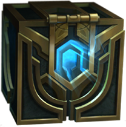

<h1 align="center">
    
</h1>

<h4 align="center"> 
	🚧 Hextech Chest Champions 1.0 🚀 em construção... 🚧
</h4>

<p align="center">
  

  

  <a href="https://www.linkedin.com/in/igortuag/">
    
  </a>
	
  
  <a href="https://github.com/igortuag/hextech-chest-champions/commits/master">
    
  </a>

  
   <a href="https://github.com/igortuag/hextech-chest-champions/stargazers">
    
  </a>
</p>

## 💻 Sobre o projeto

Hextech Chest Champions - Surgiu da necessidade de anotar todos campeões que já peguei bau no lol, para que quando fosse jogar Aram pudesse consultar de forma rapida e pratica.

A principio o jogador poderá:

- listar todos os campeões do lol
- marcar e desmarcar aqueles que já pegou bau
- a principio será armazenado no storage do navegador

## 🎨 Layout

<p></p>

O layout da aplicação foi baseado na lista de campeões do lol

## 🛠 Tecnologias

As seguintes ferramentas foram usadas na construção do projeto:

- [VueJS][http://vuejs.org/]
- [Axios][https://github.com/axios/axios]
- [Sass][https://sass-lang.com/]

## 🚀 Como rodar este projeto

## Instalação

```
yarn install
```

### Compilação para desernvolvimento

```
yarn serve
```

### Compilação e minificação para deploy

```
yarn build
```

### Lints e formatações

```
yarn lint
```

### Configurações adicionais

Veja em [Referência de Configuração](https://cli.vuejs.org/config/).

## 😯 Como contribuir para o projeto

1. Faça um **fork** do projeto.
2. Crie uma nova branch com as suas alterações: `git checkout -b my-feature`
3. Salve as alterações e crie uma mensagem de commit contando o que você fez: `git commit -m "feature: My new feature"`
4. Envie as suas alterações: `git push origin my-feature`
   > Caso tenha alguma dúvida confira este [guia de como contribuir no GitHub](https://github.com/firstcontributions/first-contributions)

## 📝 Licença

Este projeto esta sobe a licença MIT. Veja a [LICENÇA](license) para saber mais.

Feito com ❤️ por Igor Tuag 👋🏽 [Entre em contato!](https://www.linkedin.com/in/igortuag/)
